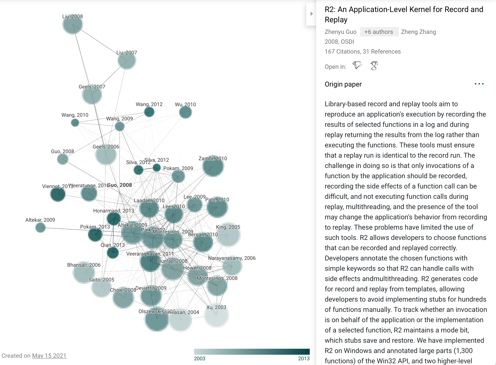
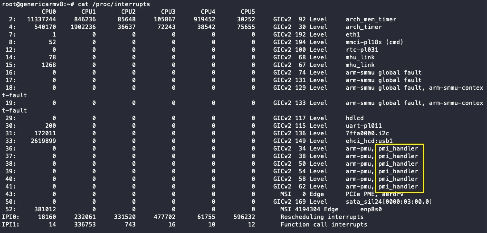
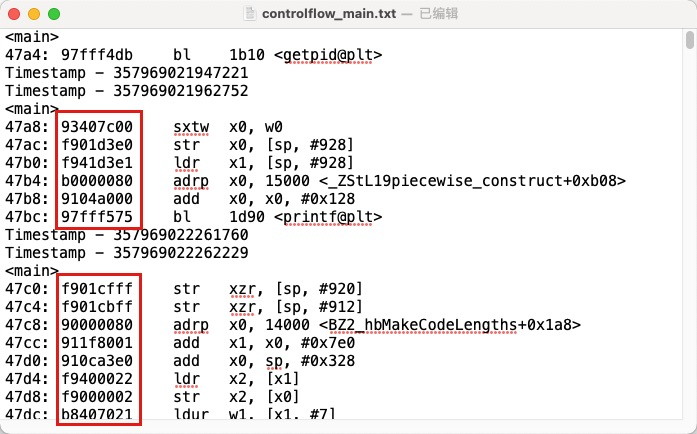
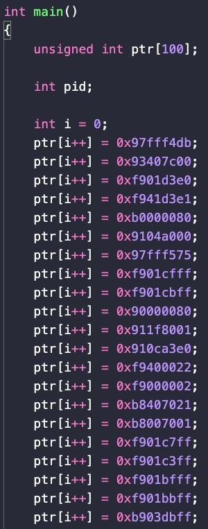

# Haonan

## Plan of Last Week

- Write some random words for my graduation project. (deadline: May 14)
- Determine what the next of our project, make more improvement?
- Prepare for apper sharing: Mozilla's rr

---

## Progress

- Finished graduation project before May 14, 11:58 PM
- Discussed about the future work last Friday.
- Finding many papers

---

## Schedule for future

\footnotesize
| **Task** | **Assignee** | **Priority** |
| ----------------------------------------------------------- | ------------ | ------------ |
| Improve syscord: more syscalls, size optimization | Xueying | 1 |
| Fix bug: control flow timestamp position error | Yuxin | 1 |
| Using PMI to dump ETM automatically (ref: HART) | Wenxuan | 1 |
| More sequence bugs | Yiming | 2 |
| Analysis automatically (e.g., apply patterns) | Yiming | 2 |
| Non-deterministic handlers: interrupt, trap, signal | Haonan | 2 |
| Improve library hook | Yuxin | 3 |
| Find a general way to handle library functions | Haonan | 3 |
| Scale up: for large size application, for long-term running | Yiming | 4 |
| Replay machine | Wenxuan | 5 |

---

## Syscord: a bug

- cannot write file after 2.1 G (found in Apr 24, 3 weeks ago)
- bypass approach: open 10 files at beginning, when a file up to 2.1 G, write to another one
- reason: an ancient problem, associated with 32-bit systems...
- `-D_FILE_OFFSET_BITS=64` or ... `O_RDWR | O_CREAT | O_LARGEFILE`

---

## Discussion for future work

- Improve syscord:
  - More syscalls, optimization on performance and record size
  - More Non-deterministic events: interrupt, trap, signal
- Library Hook: find a general way to handle library functions

---

## Dilemma: How to handle library functions

- Ignore it: configure ETM to trace all instrctions in user space
  - result in a huge size of trace result (considering with or without `-static`)
- Record library functions, as syscalls
  - There are only 276 syscalls, while infinite numbers of library functions.
  - How to record the side effect of library functions?

---

## Try to address these problems: paper reading

\tiny
| Name | Titile | Author Affiliation | Conference | Heighlight |
| -------- | ------------------------------------------------------------ | ------------------- | --------------------- | --------------------------------------------- |
| RR | **Engineering** Record And Replay For **Deployability** | Mozilla | ATC'17 | RnR system |
| R2 | An Application-Level Kernel for Record and Replay | Microsoft | OSDI'08 | Library |
| Castor | Towards Practical **Default-On** Multi-Core Record/Replay | Stanford | ASPLOS'17 | Deafult On |
| `liblog` | Replay Debugging for Distributed Applications | Berkeley | ATC'06 | Lib Log |
| Scribe | Transparent, Lightweight Application Execution Replay on Commodity Multiprocessor Operating Systems | Columbia | SIGMETRICS’10 (CCF-B) | 2.5% overhead? Re-execution instrad of replay |

---

## Paper Connection of R2

Powered by Connected Papers
{width=90%}

---

## Some other things...

- Linux AIO (asynchronous IO)
- `io_submit`, `io_getevents`
- As far as we know, RR does not support AIO: `io_setup error: Function not implemented`
- looks like the only way to handle asynchronous events is, add a delay

---

## Plan for Next Week

- Read paper, read paper, read paper, desgin for library hook
- Prepare for apper sharing: Mozilla's rr (**still NOT for next week**)

# Wenxuan

---

## Plan

Due to our meeting, I have two main targets:

1. using PMI to help collect ETM log periodicly.
2. Implement a Replay Machine for online tracing stage.

---

## Interrupt handler in kernel

Much easier than register a interrupt handler in ATF.

```c
unsigned long irq_flags = IRQF_PERCPU 
                 | IRQF_NOBALANCING 
                 | IRQF_NO_THREAD 
                 | IRQF_SHARED;
request_irq(irq_id, pmu_irq_handler, 
            irq_flags, "pmi_handler", 
            (void*)pmu_irq_handler);
```

---

## Tips on handle interrupt in kernel

### Interrupt Mapping
- Interrupt ID in kernel (logic interrupt ID) is different from the hardware interrupt ID.
- Logic interrupt ID is not always adding a simple offset.
- Linux kernel remains logic interrupt ID 36, 37, 38, 39, 40, 41 for PMU in Juno board r2.

### Exclusive Handler
- Normally an interrupt can only have one handler.
- Unless that irq_flag contains `IRQF_SHARED`.

---

## Register a co-existing handler 

After everything is set up, our kernel module successfully handles PMI.



---

## One more question: why use interrupt mapping?

- Interrupt Controller => IRQ Chip => Multi-level Interrupt Controller
- multi IRQ Domain (where IRQ handler takes effect)
 
### Mapping Models

- Linear Mapping. `irq_domain_add_linear()`, map similar interrupts together. (e.g. our Arm PMI)
- Radix Tree Mapping. `irq_domain_add_tree()`, use hardware id as lookup key in the radix tree. (e.g. MIPS hardware)

---

## Replay Machine

Since we got a ridiculous score from the professor ...

### Experiment

Replay a simple binary with no *non-deterministic* factors.

---

## Experiment

This is the control flow we reconstructed before.



---

## Construct

- disassemble
- use ETM output to locate code blocks
- collect "waterfall" control flow

We consider the "waterfall" control flow unacceptably large. We are going to construct a block dynamically.


## Re-Execute

::: columns

:::: column



::::

:::: column

. . .

Segmentation fault.

### Registers
- The initial state of registers are different.
- Store and restore registers (user space context switch).

### Sections
- Origin data, bss memory section are not copied.
- Copy static memory sections like data and bss.

::::

:::

---

## Next Week's Plan

- Store and restore registers
- Final Exam :(

# Xueying

---

## Last week's plan

Replay machine

---

## This week's work

take final exams.

---

## Next week's plan

Replay machine
